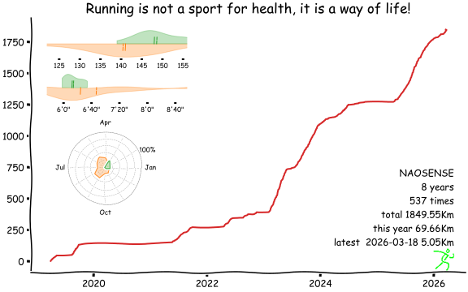

# miles

As the film *Forrest Gump* said

> run, Forrest, run...



## Motivation

As an English proverb said, "many a little makes a mickle ", we Chinese say "不积跬步，无以至千里", it means if you don't accumulate steps, you can't go a thousand miles.

As a runner, If you run one kilometer a day, it looks inconspicuous, but if you stick to it for one year, you can run 365 kilometers, and if you stick to ten years, it will be 3650 kilometers…, not to mention that you will run faster and faster, more and more. So I wrote this software to motivate myself, it's the distance history for a runner.

## Usage

1. fork the repo
2. replace personal information `RUNNER` variable in `main.py' with yours
3. update your running data, copy your data to running.csv
4. config a syncer to update running data every day

    - garmin
        
        1. set up github action secrets
            - `GARMIN_USERNAME`: your garmin account username
            - `GARMIN_PASSWORD`: your garmin account password
            - `GH_TOKEN`: a github token
       
            
            
        2. edit `garmin.py`, replace `GITHUB_WORKFLOW_ID`
        
            > how to get your http workflow id?
            > 
            > `curl https://api.github.com/repos/{your username}/miles/actions/workflows -H "Authorization: token {your token}"`

   - or with running_page

       2.1 add crontab job, for example
        ```
        31 2 * * * /usr/bin/env bash -c 'cd /home/user/bin/syncer && source /home/user/bin/syncer/venv/bin/activate && python running_page.py <your github running_page repo, like yihong0618/running_page>
        ```
5. Hurray! You've done it

## Thanks

This software is inspired by [iBeats](https://github.com/yihong0618/iBeats) and [star-history](https://github.com/star-history/star-history), thank you two for creating such a great software.
