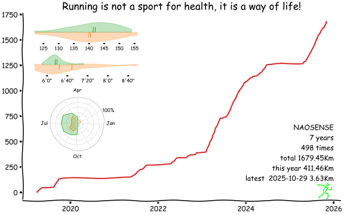

# miles

As the film *Forrest Gump* said

> run, Forrest, run...



## Motivation

As an English proverb said, "many a little makes a mickle ", we Chinese say "不积跬步，无以至千里", it means if you don't accumulate steps, you can't go a thousand miles.

As a runner, If you run one kilometer a day, it looks inconspicuous, but if you stick to it for one year, you can run 365 kilometers, and if you stick to ten years, it will be 3650 kilometers…, not to mention that you will run faster and faster, more and more. So I wrote this software to motivate myself, it's the distance history for a runner.

## Usage

1. fork the repo
2. replace personal information with yours
3. update your running data
    1. by http

        ```bash
        curl -H "Content-Type:application/json" -X POST -d '{"inputs": {"dt":"2023-08-06 12:00:01", "distance":"3.02"}, "ref":"master"}' https://api.github.com/repos/{your username}/miles/actions/workflows/{your http workflow id}/dispatches -H "Authorization: token {your token}"
       ```

       how to get your http workflow id?

       ```bash
       curl https://api.github.com/repos/{your username}/miles/actions/workflows -H "Authorization: token {your token}"
       ```

   2. by update running.csv
4. link your running svg everywhere ^_^.

(Optional) config a syncer

1. garmin

    1.1 edit garmin.py, replace token and workflow id

    1.2 add crontab job, for example

    ```
    31 2 * * * /usr/bin/env bash -c 'cd /home/user/bin/syncer && source /home/user/bin/syncer/venv/bin/activate && python garmin.py user password --is-cn --only-run'
    ```

2. running_page

    2.1 add crontab job, for example
    ```
    31 2 * * * /usr/bin/env bash -c 'cd /home/user/bin/syncer && source /home/user/bin/syncer/venv/bin/activate && python running_page.py <your github running_page repo, like yihong0618/running_page>
    ``` 

## Thanks

This software is inspired by [iBeats](https://github.com/yihong0618/iBeats) and [star-history](https://github.com/star-history/star-history), thank you two for creating such a great software.
